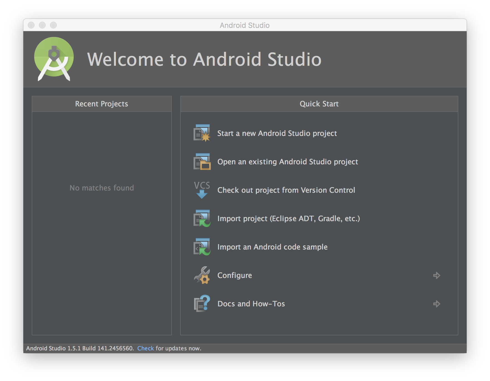
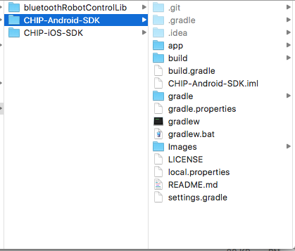
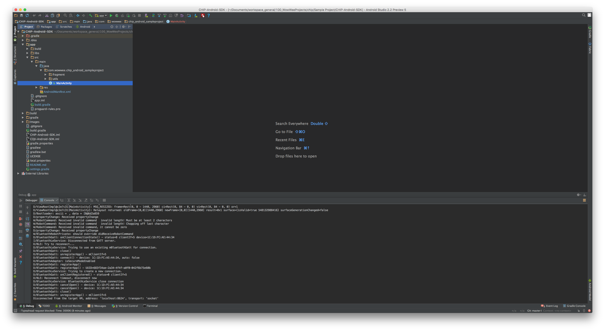

Vobot
================================

Vobot is an Android App that controls a language therapy robot, the WowWee CHIP, to assist autistic child’s language acquisition. The app works on devices running Android 4.3 and above with Bluetooth Low Energy chipsets. To use this app, you will also need a physical CHIP robot. For language processing, Vobot uses an API called SpeechAce: speechace.com

Table of Contents
---------------------------------------

- [Quick Installation](#quick-installation)
- [License](#license)
- [Purchase CHIP](#purchase-chip)

Quick Installation
---------------------------------

1. Clone the repository or [download the zip](https://github.com/WowWeeLabs/CHIP-Android-SDK/archive/master.zip).

		git clone https://github.com/priyakapadia/Vobot.git

2. Open Android Studio and click "Open an existing Android Studio project".

	

3. Select the git project folder "CHIPAndroidSampleProject" and click "Choose".

	

4. You should be now ready to go! Plug in an Android device then compile and run the project using CTRL + R on Mac, or SHIFT + F10 on Windows. When you turn on a CHIP, you should see some debug messages in the logs.

	

License
---------------------------------
Vobot is available under the Apache License, Version 2.0 license. See the [LICENSE.txt](https://github.com/priyakapadia/Vobot/blob/master/LICENSE.md) file for more info.

Purchase Chip
---------------------------------
CHIP is available for purchase here: https://wowwee.com/chip
